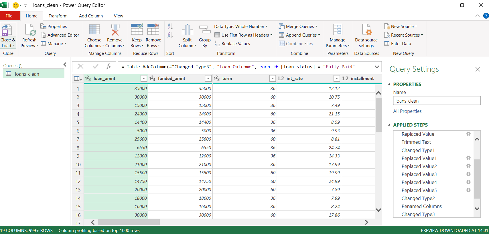
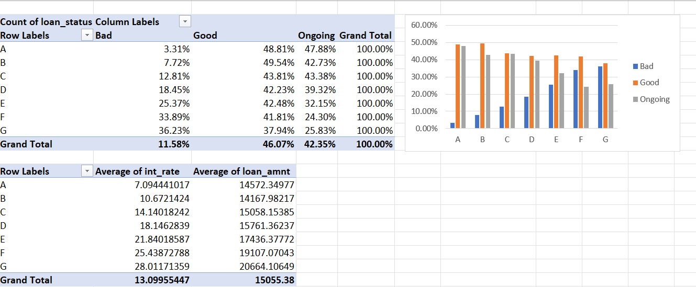

# LendingClub Loan Risk & Return Analysis
 
An end-to-end analysis of **150,000 LendingClub loans**, taken from a raw 1.19 GB source file all the way to an interactive dashboard. Built with **Python** (preprocessing), **Excel / Power Query** (cleaning and exploratory analysis), and **Power BI** (data modeling, DAX, and the final dashboard). The focus: which loans default — and, more importantly, which ones actually make money.
 
---
 
## Key Insight
 
**The highest-interest loans are not the most profitable.**
 
LendingClub prices risk into its grades, so lower grades carry much higher interest rates. But once defaults are accounted for, return on investment **inverts**: the safest grades (A and B) return roughly **+5%**, while the riskiest grades (F and G) post **negative** returns, with grade G near **−8%**. A lender chasing headline interest rates on low-grade loans would lose money.
 
---
 
## Business Question
 
Across a portfolio of 150,000 loans, which segments — by credit grade, loan purpose, borrower profile, and geography — drive defaults, and how does that translate into *actual* return once losses are counted?
 
---
 
## Tools & Skills
 
| Stage | Tool | Skills demonstrated |
|-------|------|---------------------|
| Preprocessing | Python (pandas) | Chunked reading of a 1.19 GB file, column selection, sampling |
| Cleaning & EDA | Excel / Power Query | Data-type fixes, categorical normalization, conditional columns, PivotTables |
| Modeling & viz | Power BI | Data modeling, DAX measures, interactive multi-page dashboard |
 
---
 
## Project Workflow
 
### 1. Data acquisition
 
The dataset is LendingClub's public accepted-loans file (2007–2018), roughly **2.26 million rows × 145 columns** and **1.19 GB** on disk — far too large to open in Excel and slow to work with directly in Power BI.
 
### 2. Preprocessing — reducing 1.19 GB to a workable sample (Python)
 
Rather than load the whole file into memory, the raw CSV is read in chunks, narrowed to the 18 columns the analysis actually needs, and sampled down to 150,000 rows. The messy text fields are deliberately left untouched here, so the cleaning can be demonstrated in Power Query.
 
```python
import pandas as pd
 
cols = [
    "loan_amnt", "funded_amnt", "term", "int_rate", "installment",
    "grade", "sub_grade", "emp_length", "home_ownership", "annual_inc",
    "verification_status", "issue_d", "loan_status", "purpose",
    "addr_state", "dti", "total_pymnt", "recoveries"
]
 
# read in 200k-row chunks so the full 1.19 GB never sits in memory at once
chunks = pd.read_csv("accepted_2007_to_2018Q4.csv", usecols=cols,
                     chunksize=200_000, low_memory=False)
df = pd.concat(chunks, ignore_index=True)
 
df = df.dropna(subset=["loan_status"])
df = df.sample(n=150_000, random_state=42)
df.to_csv("loans_clean.csv", index=False)
```
 
Result: a 150,000-row, 18-column file ready for cleaning. Full script in [`scripts/make_powerbi_csv.py`](scripts/make_powerbi_csv.py).
 
### 3. Data cleaning (Excel / Power Query)
 
The sampled file was loaded into Excel via Power Query, where four transformations were applied:
 
- **`term`** — stripped the " months" text and converted to a whole number (36 / 60).
- **`emp_length`** — normalized the text ("< 1 year" → 0, "10+ years" → 10, stripped " year(s)") into a numeric `emp_years`, keeping nulls for "n/a" so they're correctly ignored in aggregations.
- **`issue_d`** — converted the text date into a proper Date type for time-series analysis.
- **`Loan Outcome`** — a conditional column bucketing `loan_status` into **Good** (Fully Paid), **Bad** (Charged Off / Default), and **Ongoing** (Current, Late, etc.). This single derived field drives most of the risk analysis.

 
### 4. Exploratory analysis (Excel PivotTables)
 
Before building the dashboard, the cleaned data was explored in Excel with PivotTables — default rate by grade (using % of Row Total on the outcome split), average interest rate and loan size by grade, and loan volume by purpose. This confirmed the core patterns before committing them to the dashboard.
 

 
### 5. Data modeling & measures (Power BI / DAX)
 
The cleaned Excel table was loaded into Power BI and the following measures were written in DAX:
 
```dax
Total Loans      = COUNTROWS('loans')
Total Funded     = SUM('loans'[funded_amnt])
Avg Interest Rate = AVERAGE('loans'[int_rate])
 
Bad Loans        = CALCULATE([Total Loans], 'loans'[loan_status] IN {"Charged Off", "Default"})
Default Rate %   = DIVIDE([Bad Loans], [Total Loans])
 
-- Profitability is measured on COMPLETED loans only (see methodology note)
Completed Funded   = CALCULATE([Total Funded], 'loans'[loan_status] IN {"Fully Paid", "Charged Off"})
Completed Payments = CALCULATE(SUM('loans'[total_pymnt]), 'loans'[loan_status] IN {"Fully Paid", "Charged Off"})
Net Return         = [Completed Payments] - [Completed Funded]
ROI %              = DIVIDE([Net Return], [Completed Funded])
```
 
---
 
## Dashboard
 
### Portfolio Overview
KPI cards, funding trend (2007–2018), and loan-outcome mix.
 

 
### Risk Analysis
Default rate by grade, purpose, and state, plus ROI by grade.
 

 
### Borrower Profile
Income and DTI by segment, home ownership, with interactive slicers.
 

 
---
 
## Key Findings
 
- **Default rate climbs cleanly with grade:** ~3% (A) up to ~37% (G).
- **ROI inverts with grade:** +5% (A/B) down to −8% (G) once defaults are counted.
- **Riskiest loan purposes:** renewable energy (~23%), small business (~17%), moving (~15%).
- **Riskiest states:** Alabama, Louisiana, and South Dakota lead, all above ~13%.
- **Borrower signal:** defaulted loans carry a higher debt-to-income ratio (~20) than fully-paid loans (~17.5).
- **Portfolio totals:** $2.26bn funded, 11.6% charge-off rate, 13.1% average interest rate.
---
 
## A note on methodology
 
ROI is calculated only on **completed** loans (Fully Paid + Charged Off). Loans still marked "Current" are excluded, because their payments-to-date are incomplete and including them would overstate the true return. This is why the profitability figures are meaningful rather than misleadingly optimistic.
 
---
 
## Repository
 
| Path | Description |
|------|-------------|
| `scripts/make_powerbi_csv.py` | Preprocessing — raw 1.19 GB file to a 150K sample |
| `excel/loansmanualclean.xlsx` | Cleaned data + Excel PivotTable analysis |
| `dashboard/loans_dashboard.pbix` | Power BI dashboard (3 pages) |
| `screenshots/` | Dashboard and Excel process images |
 
**Data source:** LendingClub public loan data, 2007–2018 (Kaggle).[kaggle-dataset](https://www.kaggle.com/datasets/wordsforthewise/lending-club)
