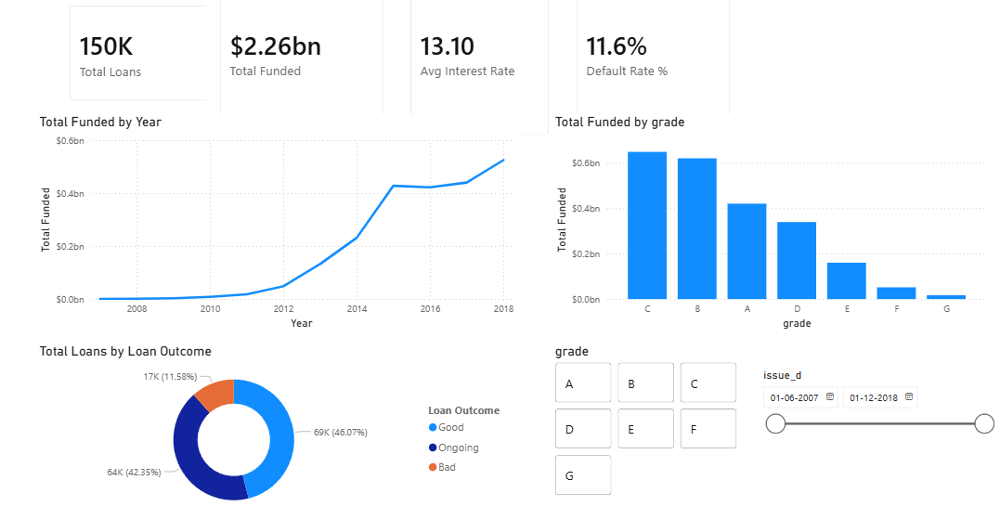
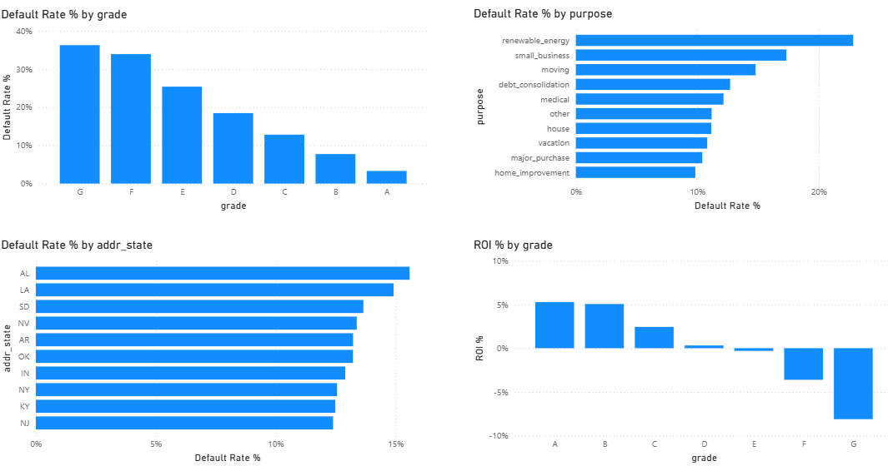
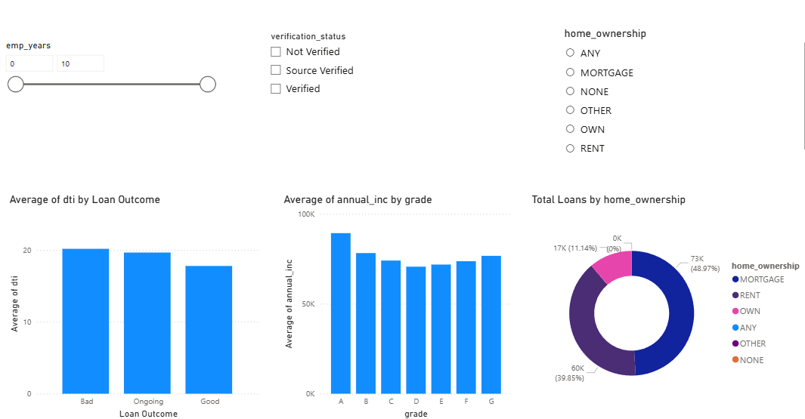

# LendingClub Loan Risk & Return Analysis

An end-to-end analysis of **150,000 LendingClub loans**, built in **Excel** (data preparation and exploratory analysis) and **Power BI** (interactive dashboard), examining which loans default — and, more importantly, which ones actually make money.

---

## Key Insight

**The highest-interest loans are not the most profitable.**

LendingClub prices risk into its grades — lower grades carry much higher interest rates. But once defaults are accounted for, return on investment **inverts**: the safest grades (A and B) return roughly **+5%**, while the riskiest grades (F and G) post **negative** returns, with grade G at around **−8%**. A lender chasing headline interest rates on low-grade loans would lose money.

---

## Business Question

Across a portfolio of 150,000 loans, which segments — by credit grade, loan purpose, borrower profile, and geography — drive defaults, and how does that translate into *actual* return once losses are counted?

---

## Tools & Skills

- **Excel** — Power Query for cleaning messy fields (loan term, employment length, issue date) and deriving a Good / Bad / Ongoing outcome classification; PivotTables and PivotCharts for exploratory analysis.
- **Power BI** — data modeling, DAX measures (default rate, completed-loan ROI, net return), and a three-page interactive dashboard with cross-filtering slicers.
- **Python (pandas)** — chunked preprocessing of the raw 1.19 GB source file.

---

## Approach

1. Reduced the raw 1.19 GB LendingClub file (2.26M rows × 145 columns) to 18 analysis columns and a 150,000-row sample using a chunked pandas read.
2. **Excel:** transformed the messy categorical fields, derived the loan-outcome label, and ran exploratory PivotTables (default rate by grade, pricing by grade, volume by purpose).
3. **Power BI:** built the DAX measures and a three-page dashboard.

---

## Key Findings

- **Default rate climbs cleanly with grade:** ~3% (A) up to ~37% (G).
- **ROI inverts with grade:** +5% (A/B) down to −8% (G) once defaults are counted.
- **Riskiest loan purposes:** renewable energy (~23%), small business (~17%), moving (~15%).
- **Riskiest states:** Alabama, Louisiana, and South Dakota lead, all above ~13%.
- **Borrower signal:** defaulted loans carry a higher debt-to-income ratio (~20) than fully-paid loans (~17.5).
- **Portfolio totals:** $2.26bn funded, 11.6% charge-off rate, 13.1% average interest rate.

---

## Dashboard

### Portfolio Overview
KPI cards, funding trend (2007–2018), and loan-outcome mix.

### Risk Analysis
Default rate by grade, purpose, and state, plus ROI by grade.

### Borrower Profile
Income and DTI by segment, home ownership, with interactive slicers.

---

## A note on methodology

ROI is calculated only on **completed** loans (Fully Paid + Charged Off). Loans still marked "Current" are excluded, because their payments-to-date are incomplete and including them would overstate the true return. This is why the profitability figures are meaningful rather than misleadingly optimistic.

---

## Repository

| File | Description |
|------|-------------|
| `loans_dashboard.pbix` | Power BI dashboard (3 pages) |
| `loansmanualclean.xlsx` | Cleaned data + Excel PivotTable analysis |
| `make_powerbi_csv.py` | Preprocessing script (raw file → 150K sample) |
| `/screenshots` | Dashboard images |

**Data source:** LendingClub public loan data, 2007–2018 (Kaggle). [kaggle-dataset](https://www.kaggle.com/datasets/wordsforthewise/lending-club)
